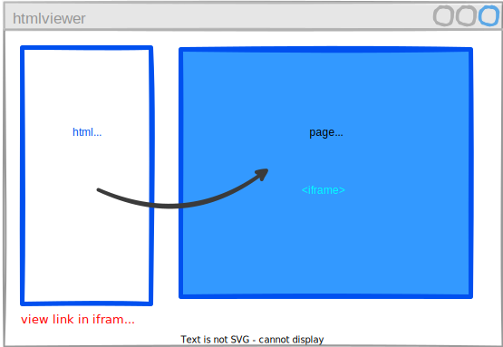
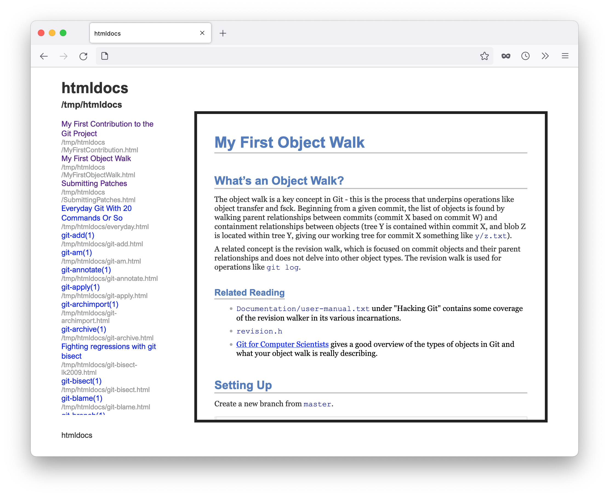

# htmlviewer


Simple tool for viewing all your web pages in one place  using iframes as a target for links

<center>

</center>

<br>

## Install

```sh
npm install -g htmlviewer
```

## Usage

```sh
htmlviewer /path/with/html/files
```

## Example


<center>

</center>

```sh
cd /tmp
git clone https://github.com/git/htmldocs.git
htmlviewer /tmp/htmldocs
```

